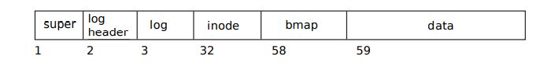

 Answers may be found here: https://www.ics.uci.edu/~aburtsev/143A/2017winter/final-answ/paper.pdf

# Fall 2017
# Question 1
> Topic: File system

Xv6 lays out the file system on disk as follows:

Block 1 contains the super block. Blocks 2 through 31 contain the log header and the log.
Blocks 32 through 57 contain inodes. Block 58 contains the bitmap of free blocks. Blocks 59
through the end of the disk contain data blocks.
Ben modifies the function bwrite in bio.c to print the block number of each block written.
Ben boots xv6 with a fresh fs.img and types in the command rm README, which deletes the
README file. This command produces the following trace:
<pre>
$ rm README
write 3
write 4
write 5
write 2
write 59
write 32
write 58
write 2

$
</pre>
## Part A
### Problem
(5 points) Briefly explain what block 59 contains in the above trace. Why is it written?

### Solution
Block 59 contains the data for the “/” directory inode. Since Ben delets the file from the
“/” the directory inode is updated.

## Part B
### Problem
What does block 5 contain? Why is it written?
### Solution

Block 5 corresponds to whatever is contained in block 58 in bmap, likely updating the freed blocks positions in the memory mapping. It was written as a part of the logging process -- first write all changes to the log section, then commit the whole log section to memory and update the headers in an atomic style. If  it crashes, we can just reexecute saving from log into memory w/o potential corrupt files

## Part C
### Problem
(10 points) How many non-zero bytes are written to block 2 when it’s written the first
time and what are the bytes? (To get the full credit you have to explain what block 2
contains, and why each non-zero byte is written).

### Solution
Block 2 will contain a record of all transactions in the log that should be written over into the disk. It holds n, the size of the write, and a ptr to the series of blocks held in the log header. In our situation, the size is 3, for the 3 blocks written, and the array contains [3, 4, 5] to match the array of blocks. Therefore, there are 16 bytes written that are non-zero

# Question 2
> Topic: Synchronization
## Part A

(a) (5 points) Ben runs xv6 on a single CPU machine, he decides it’s a good idea to get
rid of the acquire() and release() functions, since after all they take some time but seem
unnecessary in a single-CPU scenario. Explain if removal of these functions is fine.

### Solution
No this is not fine as there is a very real possibility that under a single CPU machine, when there is an interrupt in the middle of a neccessarily atomic instruction (like adding an item to a linked list) and there is a chance that interrupt will alter the value of that linked list, loosing a value for instance, or messing up some protected/critical data structure.

# Question 3
> Topic: Process memory layout

Bob decides to implement the following xv6 program (hello) 

<pre>
#define PGSIZE 4096
int main(int argc, char *argv[]) {
    char buf[PGSIZE] = {0};
    printf(1, "Hello World!, %p\n", buf);
    exit();
}
</pre>
## Part A
### Problem
(10 points) When Bob runs it he encounters the following error message:  
pid 3 hello: trap 14 err 7 on cpu 1 eip 0x22 addr 0x1fd0--kill proc  
Can you help Bob understand the problem? (To receive full points, you should explain
why this error happened, what does the error values mean and how Bob can fix his code)

### Solution
Trapno 14 means that there was a page fault. To my understanding, the reasoning this happened was due to the buf that was allocated -- since it was of size of 4096, having a buffer of 4096 bytes. Therefore, when print is called, they try and push the values onto stack to call printf -- but since buf is local, it has already taken 4096 bytes, the size of the 1 page stack and xv6 allocates, causing an error. To fix this, he could dynamically allocate his buffer, or shrink the size of his buffer

# Question 4
> Topic: Virtual memory
Ben wants to know the address of physical pages that back up virtual memory of his process.
He digs into the kernel source and comes across the V2P() macro that is frequently used in the
kernel.  
#define KERNBASE 0x80000000  
#define V2P(a) (((uint) (a)) - KERNBASE)  
He decides to try the V2P macro in his program (below), but encounters a crash.
<pre>
void test(void) {
    int a;
    *(uint*)V2P(&a) = 0xaddb;
    printf(1, "I changed physical memory at %x\n", a);
}
int main(int argc, char *argv[]) {
    test();
    exit();
}
</pre>

## Part A
### Problem
(a) (5 points) Explain what is going on and why Ben’s program crashes.

### Solution
Since he tries to access memory in the high memory address at 0x80000000 + , this is typically in the address space of the kernel. Since this is an unsigned int, when you subtract KERNBASE, this value (which is at vaddr somewhere beneath KERNBASE) will overflow and become KERNBASE +, leading to attempts to access memory outside your ability to access, and therefore an error is thrown when we try to set it with Ben's program

## Part B
### Probelm
(5 points) Ben puts the code of the test() function inside a new system call trying to see
if it works inside the kernel. Will it work (explain your answer)?

### Solution
It would run successfully, however, would not give the proper behavior due to paging being enabled and access of that high memroy address would likely lead to setting the value of some addr in kernel (maybe the stack, maybe some code) but would lead to a faulty set of information

# Question 5
Ben wants to extend xv6 with demand paging. Ben observes that some pages of user processes
(heap, text, and stack) are not accessed that frequently, yet anyway they consume valuable
physical memory. So Ben comes up with a plan to free these infrequently used pages by saving
them to disk (swapping). For an idle page he plans to unmap it from the process page table,
save content of the page to disk (i.e., in a special swap area on disk), and free the physical
page back to the kernel, making it accessible for other processes. Obviously, Ben wants paging
to be transparent. I.e., when a process accesses one of the swapped pages, Ben plans to catch
an exception, allocate a new physical page, read old content of the page from disk, and fix the
process page table in such a way that process can access the page like nothing happened.

## Part A
### Problem
(5 points) How can Ben unmap a page from the process address space? I.e., what changes
to the process page table are required to catch an exception when the process tries to
access a swapped page (hint: look at how guard page is implemented)?
### Solution
By removing the user-mode bit from these pages, this will auto trigger a page fault exception whenver an attempted access are made to these locations, and therefore are unmapped.

## Part B
### Problem
(10 points) Ben plans to catch the exception caused by an unmapped page access inside
the trap() function. Provide a sketch for the code that implements the exception handling,
reads page from disk, and maps it back into the process address space

### Solution
(NOT SURE ABOUT THIS ONE, PLEASE VERIFY)
<pre>
void
trap(struct trapframe *tf)
{
    ...
    switch(tf->trapno){
        ...
        case T_PGFLT:
            if outside of valid range or is gaurd page/illegal access:
                execute page fault
            else if in unmapped page table:
                reload page from assosciated addr in disk
                return

            execute pagefault
        ...
    }

}
</pre>

# Question 6

Alice executes the following program
<pre>
main() {
    char *msg = "bar\n";
    int pid = fork();
    if (pid)
        msg = "foo\n";
    else
        msg = "baz\n";
    write(1, msg, 4);
    exit(0);
}

</pre>

## Part A
### Problem
(5 points) What are all possible outputs of this program? Explain your answer
### Solution
can be 
<pre>
foo
</pre>
or
<pre> 
baz
</pre>
as due to fork, there's a possibility that either of the two messages execute last, and therefore either of the messages could be what is written

# Question 7
While editing the xv6 code, Jimmy accidentally erases the below section of
code under fork() function on proc.c
<pre>
2584 for(i = 0; i < NOFILE; i++)
2585    if(proc->ofile[i])
2586        np->ofile[i] = filedup(proc->ofile[i]);
</pre>

## Part A
### Problem
(5 points) Explain what the above section of code does?
### Solution
This section of code copies the file descriptors of the old process' table to the new file descriptor table of the newly created process

## Part B
### Problem
(5 points) Explain what can go wrong without this piece of code? Quote a concrete
example and explain the incorrect behavior.
#### Solution
This would lead to disasterous effects for piping in shell -- now since the forked process no longer copies the parent process' FDT, the pipe writes will go nowhere as the new process can not read the old process' pipe's read end.

