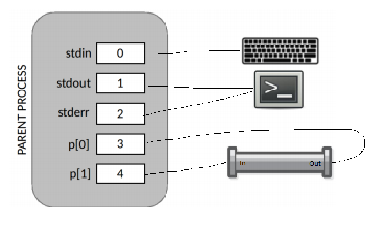
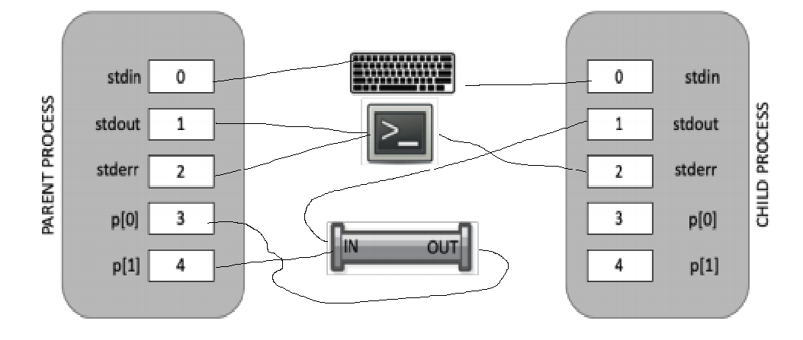
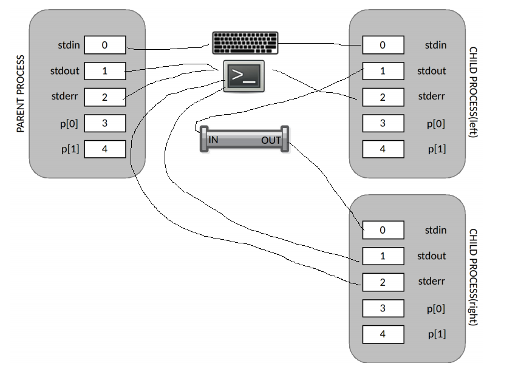

 Answers may be found here: https://www.ics.uci.edu/~aburtsev/143A/2018fall/lectures/final/paper.pdf

# Fall 2018
# Question 1
Xv6 shell implements a pipe command (e.g., ls | wc) with the following code:
<pre>
8650 case PIPE:
8651    pcmd = (struct pipecmd*)cmd;
8652    if(pipe(p) < 0)
8653        panic("pipe");
        // Point A
8654    if(fork1() == 0){
8655        close(1);
8656        dup(p[1]);
8657        close(p[0]);
8658        close(p[1]);
        // point B
8659        runcmd(pcmd>left);
8660    }
8661    if(fork1() == 0){
8662        close(0);
8663        dup(p[0]);
8664        close(p[0]);
8665        close(p[1]);
8666        runcmd(pcmd>right);
8667    }
8668    close(p[0]);
8669    close(p[1]);
        // point C
8670    wait();
8671    wait();
8672    break
</pre>
Draw the connections between file descriptors, I/O devices and pipes at points A, B above.
Connections can be depicted with lines with arrows. The error is aligned with the direction of
data flow, i.e., if the file is written the error points at the file object.
Hint: pay attention to close() dup() calls before and after the point
## Part A

## Part B

## Part C
