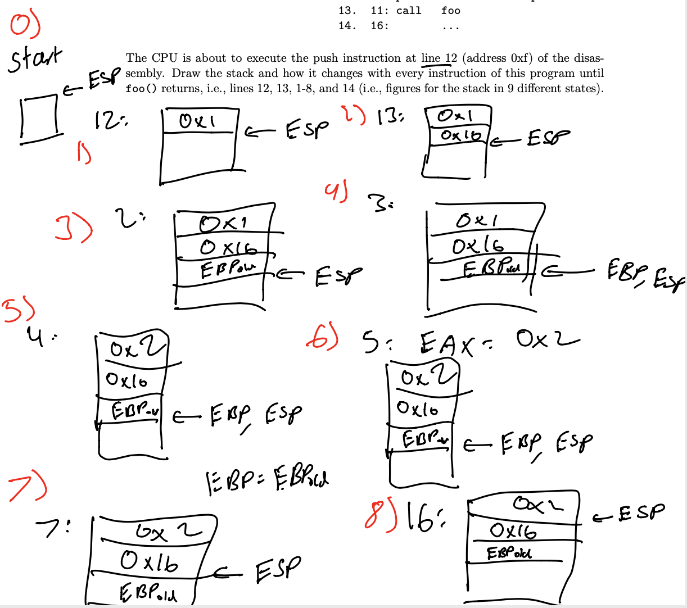

# Fall 2019
# Question 1  
> Topic: Calling Convention
## Part A
### Problem
(5 points) Below is the source code and a disassembly of a simple C pogram:
<pre>
int foo(int a){                     1. 00000000 &ltfoo&gt:
    a++;                            2. 0: push ebp
    return a;                       3. 1: mov ebp,esp
}                                   4. 3: add DWORD PTR [ebp+0x8],0x1
                                    5. 7: mov eax,DWORD PTR [ebp+0x8]

int main(int ac, char **av)         7. a: pop ebp
{                                   8. b: ret
    return foo(1);                  9.
}                                   10. 0000000c &ltmain&gt:
                                    11. ...
                                    12. f: push 0x1 <---- eip
                                    13. 11: call foo
                                    14. 16: ...
</pre>
The CPU is about to execute the push instruction at line 12 (address 0xf) of the disassembly. Draw the stack and how it changes with every instruction of this program until
foo() returns, i.e., lines 12, 13, 1-8, and 14 (i.e., figures for the stack in 9 different states).
### Solution
TODO  
  
## Part B
### Problem
(10 points) Imagine your CPU is identical to x86 but does not have call and ret instructions. How will you implement the assembly code above (i.e., your code should support
recursive invocation of functions)?
### Solution
TODO  
  

# Question 2
> Topic: Basic page tables.
## Part A
### Problem
(5 points) Which physical address is accessed by the following mov instruction?  
  
mov eax, DWORD PTR [ebx+0x8]  
  
Here the ebx register contains 0x1000, and the data segment is configured to have the base
of 0x1000.  

Page Directory Page:
<pre>
PDE 0: PPN=0x1, PTE_P, PTE_U, PTE_W
PDE 1: PPN=0x2, PTE_P, PTE_U, PTE_W
PDE 2: PPN=0x3, PTE_P, PTE_U, PTE_W
... all other PDEs are zero
</pre>
The Page Table Page at the physical address 0x1000:
<pre>
PTE 0: PPN=0x0, PTE_P, PTE_U, PTE_W
PTE 1: PPN=0x1, PTE_P, PTE_U, PTE_W
PTE 2: PPN=0x2, PTE_P, PTE_U, PTE_W
</pre>
The Page Table Page at the physical address 0x2000:
<pre>
PTE 0: PPN=0x4, PTE_P, PTE_U, PTE_W
PTE 1: PPN=0x5, PTE_P, PTE_U, PTE_W
PTE 2: PPN=0x6, PTE_P, PTE_U, PTE_W
</pre>
The Page Table Page at the physical address 0x3000:
<pre>
PTE 0: PPN=0x7, PTE_P, PTE_U, PTE_W
PTE 1: PPN=0x8, PTE_P, PTE_U, PTE_W
PTE 2: PPN=0x9, PTE_P, PTE_U, PTE_W
</pre>
### Solution
   
## Part B
### Problem
(5 points) Draw a page table (you can use the format similar to the previous question)
that maps virtual (or if you want to be more specific, linear) addresses 2GB (0x8000000)
to 2GB + 16KB (0x8004000) to physical addresses 0 to 16KB (0x4000).
### Solution

  

  

# Question 3
> Topic: Xv6 boot
## Part A
### Problem
(10 points) When xv6 boots, the boot loader loads the xv6 kernel at the physical address
0x10000 (1MB). The boot loader jumps to the entry point of the kernel ELF file which is
linked to be at 0x10000c. The first thing the xv6 kernel does is it sets up the boot-time
page table that maps two regions of vistual memory (0-4MB and 2GB-(2GB+4MB)) to
the physical range 0 to 4MB, and then jumps to the C main() function that runs in the
2GB-(2GB+4MB) range. This seems counter-intuitive: the kernel seems to be able to run
at two virtual address ranges: 0-4MB and 2GB-(2GB+4MB)—this seems to be against
the rules of linking and loading (i.e., the object file is linked to run at a specific address,
either 0x10000 or 0x80100000, but the kernel manages to run at these two location).
Can you explain how this works, i.e., what was done to allow the kernel to run in two
different address ranges?
### Solution

  
For traditon, lower 2GB of virtual address is for user-memory, from 2GB-4GB is for Kernel memory.But after bios is loaded, kernel is mapped at 1MB(1MB for BIOS booting), but we can't map it one to one to lower virtual address starts at 1MB,since we want to save lower VA for user mempry.Thus we need to shift 2GB to make sure our kernel show up at 2GB in virtual memory. Our kernel is smaller that 4MB. When we map we need entry at PTD, our entry is 512,since entry 0 map to 4MB, 2 to 8MB....keep rolling, to map half of va(at 2GB), our entry at PTD is 512(total entry is 1024, 0-511 map to 0:2GB in va).   InInitially, imaging EIP is mapped from pa to va one to one, when switch, since page table hasn't enable yet, no page to switch to, it if try to map first 4MB to page table, program will crash, since there is no entry for page table yet, a page fault. Thus can't simply map entry 512 to virtual address. As a result we have to double map---the kernel first mapped to 0-4MB in lower address first, the2GB+ to 2GB+4GB at higher address, continue mapping until to kernel at lower address and then jump to kernel at highter address, then it can remove the entry at 512 in PTD and switch to a different page table which does't map to 0-2GB virtual address.
 To summerize:
 Entry #0 0-4MB 0x0: 0x400000
 Entry #512 0x0-4MG->0x8000000:0x80400000 (2GB:2GB+4MB).
 
  
# Question 4
> Topic: Relocation
Alice compiles the following C file.
<pre>
#include&ltstdio.h&gt
int add (int a, int b) {
    printf("Numbers are added together\n");
    return a+b;
}
int main() {
    int a,b;
    a = 3;
    b = 4;
    int ret = add(a,b);
    printf("Result: %u\n", ret);
    return 0;
}
</pre>
## Part A
### Problem
(5 points) Which symbols are undefined and need to be resolved (explain your answer)?
### Solution
 

## Part B
### Problem
(5 points) Which symbols need to be relocated? Note, that C treats string constants as
globals allocated in the read-only data section. Explain your answer.
### Solution

